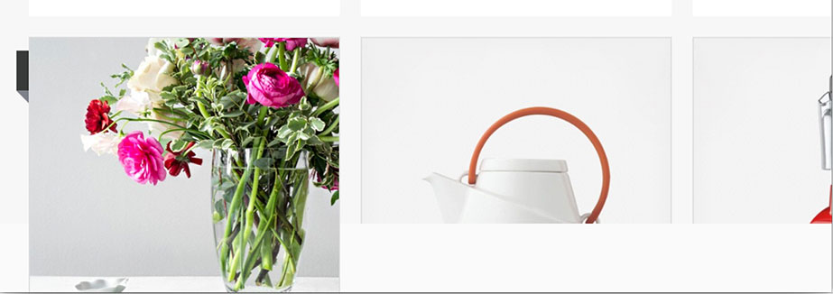
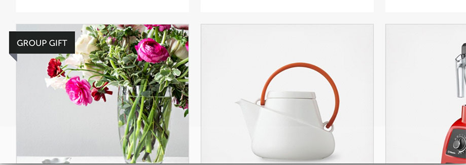
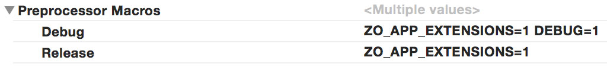

# ZOZolaZoomTransition

[](https://travis-ci.org/NewAmsterdamLabs/ZOZolaZoomTransition)
[](http://cocoadocs.org/docsets/ZOZolaZoomTransition)

`ZOZolaZoomTransition` is a zoom transition that animates the entire view heirarchy. It is used extensively in the [Zola iOS application](https://itunes.apple.com/us/app/zola-wedding-registry-gifts/id852691916?mt=8).

It looks like this:
<p align="left">

</p>

## Example

`ZOZolaZoomTransition` ships with a fully functional demo project. Listed below are the basic implementation steps. Assume a typical "Master-Detail" scenario where the "master" controller contains a `UICollectionView`, and the "detail" controller is pushed onto the stack when a cell is tapped. The transition will be animated from the selected cell's `imageView`, to the detailController's `imageView`: 

1. Implement this `UINavigationControllerDelegate` method and return an instance of `ZOZolaZoomTransition`:

  ```objective-c
  - (id <UIViewControllerAnimatedTransitioning>)navigationController:(UINavigationController *)navigationController     
                                     animationControllerForOperation:(UINavigationControllerOperation)operation 
                                                  fromViewController:(UIViewController *)fromVC 
                                                    toViewController:(UIViewController *)toVC {
      
      // Determine if we're presenting or dismissing
      ZOTransitionType type = (fromVC == self) ? ZOTransitionTypePresenting : ZOTransitionTypeDismissing;
      
      // Create a transition instance with the selected cell's imageView as the target view
      ZOZolaZoomTransition *zoomTransition = [ZOZolaZoomTransition transitionFromView:_selectedCell.imageView
                                                                                 type:type
                                                                             duration:0.5
                                                                             delegate:self];
      
      return zoomTransition;
  }
  ```

2. Implement the two required `ZOZolaZoomTransitionDelegate` methods to provide the starting and finishing frames for the target view (see [ZOZolaZolaZoomTransition.h](ZOZolaZoomTransition/ZOZolaZoomTransition.h) for detailed documentation). Frames must be returned relative to the provided `relativeView`:

  ```objective-c
  - (CGRect)zolaZoomTransition:(ZOZolaZoomTransition *)zoomTransition
          startingFrameForView:(UIView *)targetView
                relativeToView:(UIView *)relativeView
            fromViewController:(UIViewController *)fromViewController
              toViewController:(UIViewController *)toViewController {
      
      if (fromViewController == self) {
          // We're pushing to the detail controller. The starting frame is taken from the selected cell's imageView.
          return [_selectedCell.imageView convertRect:_selectedCell.imageView.bounds toView:relativeView];
      } else if ([fromViewController isKindOfClass:[ZODetailViewController class]]) {
          // We're popping back to this master controller. The starting frame is taken from the detailController's imageView.
          ZODetailViewController *detailController = (ZODetailViewController *)fromViewController;
          return [detailController.imageView convertRect:detailController.imageView.bounds toView:relativeView];
      }
  
     return CGRectZero;
  }

  - (CGRect)zolaZoomTransition:(ZOZolaZoomTransition *)zoomTransition
         finishingFrameForView:(UIView *)targetView
                relativeToView:(UIView *)relativeView
            fromViewController:(UIViewController *)fromViewComtroller
              toViewController:(UIViewController *)toViewController {
      
      if (fromViewComtroller == self) {
          // We're pushing to the detail controller. The finishing frame is taken from the detailController's imageView.
          ZODetailViewController *detailController = (ZODetailViewController *)toViewController;
          return [detailController.imageView convertRect:detailController.imageView.bounds toView:relativeView];
      } else if ([fromViewComtroller isKindOfClass:[ZODetailViewController class]]) {
          // We're popping back to this master controller. The finishing frame is taken from the selected cell's imageView.
          return [_selectedCell.imageView convertRect:_selectedCell.imageView.bounds toView:relativeView];
      }
      
      return CGRectZero;
  }
  ```

## Supplementary Views

`ZOZolaZoomTransition` supports an optional array of supplementary views that will be drawn on top of, and animated with, the other views in the animation. Two common use cases for  supplementary views are:
 
 1. To draw views that are on top of, but not a child of, the target view.
 2. To draw views that are clipped by the edge of the screen when the transition begins
    and therefore appear cut off during the animation.

This is best illustrated with an example. The row of cells below is clipped by the bottom of the screen when the user taps the left most cell. Here are two screenshots mid-transition:

**Without supplementary views:**

<p align="left">

</p>

**With supplementary views:** 
(the "Group Gift" banner and the two cells to the right have been added as supplementary views and are therefore drawn on top of the animation)

<p align="left">

</p>

## App Extensions

`ZOZolaZoomTransition` makes use of `UIApplication`'s `beginIgnoringInteractionEvents` and `endIgnoringInteractionEvents` methods which are not available inside of app extensions. To use `ZOZolaZoomTransition` in an extension, define the following preprocessor macro in the extension target's build settings: 
`ZO_APP_EXTENSIONS=1`

<p align="left">

</p>

## Setup Instructions

Install with [CocoaPods](http://cocoapods.org) by adding the following to your Podfile:

``` ruby
platform :ios, '7.0'
pod 'ZOZolaZoomTransition', '~> 1.0.0'
```

Or do it manually by adding `ZOZolaZoomTransition.h` & `ZOZolaZoomTransition.m` to your project.

## Limitations

- `ZOZolaZoomTransition` currently only works with `UINavigationController` transitions. We still need to add support for modal transitions, ideally without changing the API. Pull requests welcome!
- No support for interactive transitions yet (although this should be pretty straightforward to implement)

## Requirements

`ZOZolaZoomTransition` requires iOS 7.0 or higher.

## License

`ZOZolaZoomTransition` is available under the MIT license. See the `LICENSE` file for more info.
